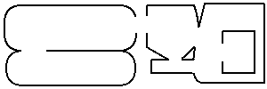
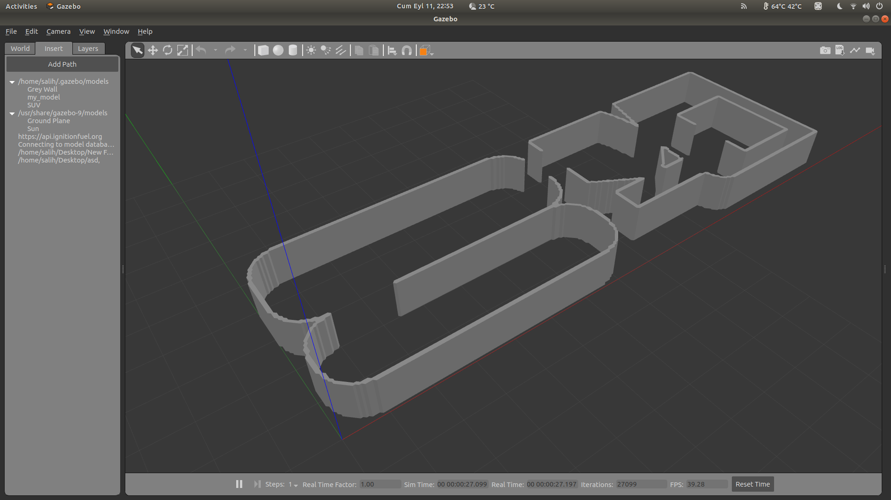
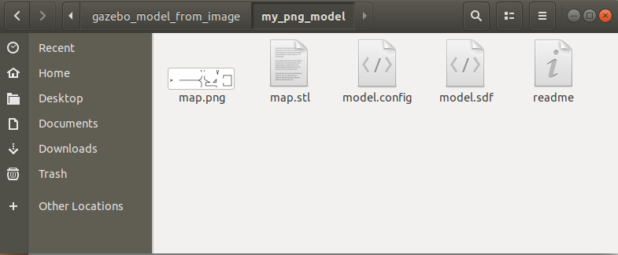

# image2gazebo
Generates SDF model for Gazebo Simulator using a simple PNG file.

<p align="center">
  
   
</p>

## 0. Parameters

```
# USAGE:
$ ./create_world.sh RESOLUTION HEIGHT MODEL_NAME INPUT_PNG_FILE
```

- **`RESOLUTION:`** Size of each pixel in the PNG file in meters. If given 0.05 each pixel will shown in Gazebo as 5cm in X and Y axes.
- **`HEIGHT:`** Height of the model in Gazebo in meters.
- **`MODEL_NAME:`** Your model name without fancy characters and whitespaces. Use underscore instead of whitespace.
- **`PNG_FILE:`** Image file made by you.


## 1. Drawing the Image File

I personally prefer using `Pinta` but you can draw your bitmap with any drawing program. 

- Firstly, you must decide on the size of the map in meters. I will go with 10 meter * 30 meter.
- Secondly, you must decide on the resolution of the model. Since it is like a maze I will go for 10 cm (= 0.1 meter).
- Open your preferred drawing program and set the image size as `x_size/resolution` and `y_size/resolution`. In our example these values are `10.0/0.1 = 100` and `30.0/0.1 = 300`. So I prepared my image with the size of 100 x 300.
- Now you can draw. But remember, according to our example every pixel will be 0.1 meter x 0.1 meter.
- Lastly, you must decide on the height of the map. Since I will use a robot like P3AT, I will set this value as 1.0 meter.


## 1. Generating the Model

- Generate the example model:

```
$ ./create_world.sh 0.1 1.0 my_png_model map.png
```

- This command will create a folder like below. This is your model:



## 2. Installing the Model

There are two different ways:

### 2.1. Installing to Local Gazebo's Models Folder

- Copy the generated folder into `~/.gazebo/models/`
- Now you can insert the model in Gazebo Simulator.

### 2.2. Installing to a ROS Package's Models Folder

- Create a `models` folder in your ROS package and copy your model into it.
- When running your simulator with a launch file add this line: (Don't forget to change `YOUR_PACKAGE_NAME`)

```xml
<env name="GAZEBO_MODEL_PATH" value="$(find YOUR_PACKAGE_NAME)/models" />
```

- Now the Gazebo should be able to find your model. You can modify your world file accordingly.